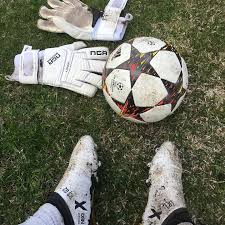
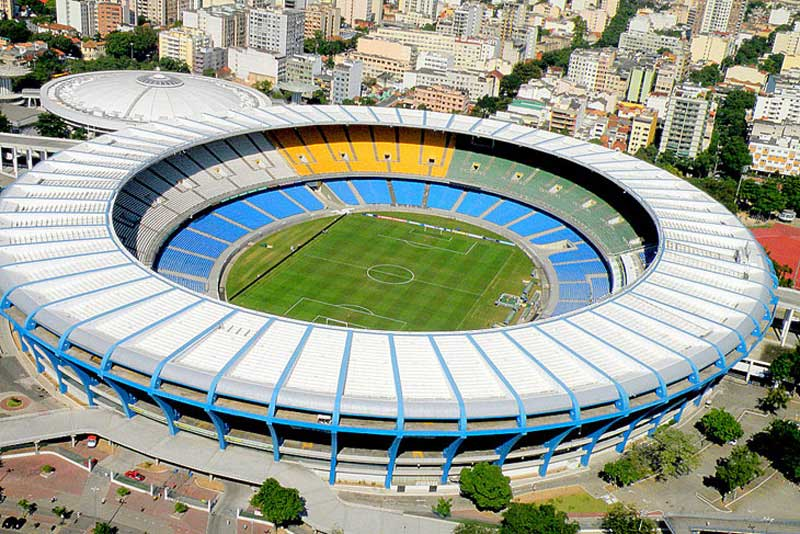

<!DOCTYPE html>
<html lang="pt-BR">
<head>
    <meta charset="UTF-8">
    <meta name="viewport" content="width=device-width, initial-scale=1.0">
    <title>Planejamento de eventos de futebol</title>
    
</head>
<body>
    

        

            
        

        

            
            

                
Planejamento de Eventos de Futebol, respectivamente: 

            

                

                
Equipamento Necessário, Equipes, Itens de Hospitalidade

            

        

        

            
        

    

</body>
</html>
